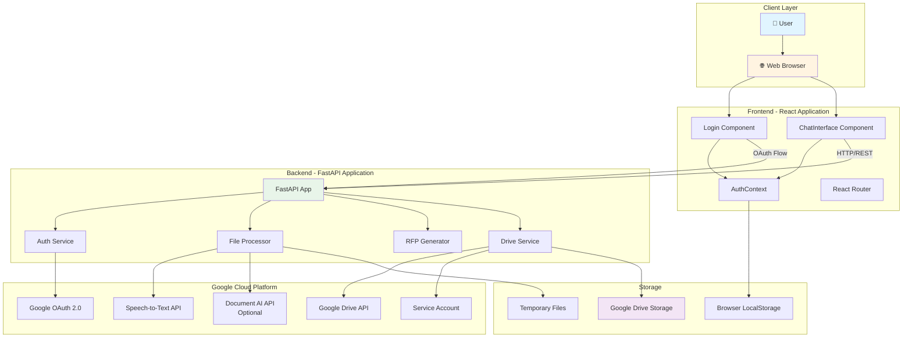
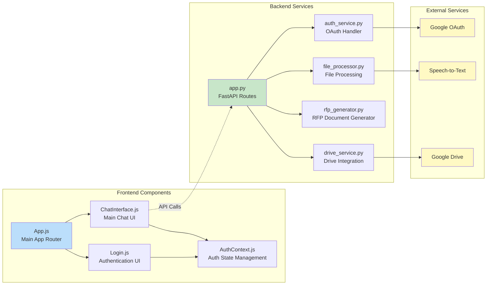
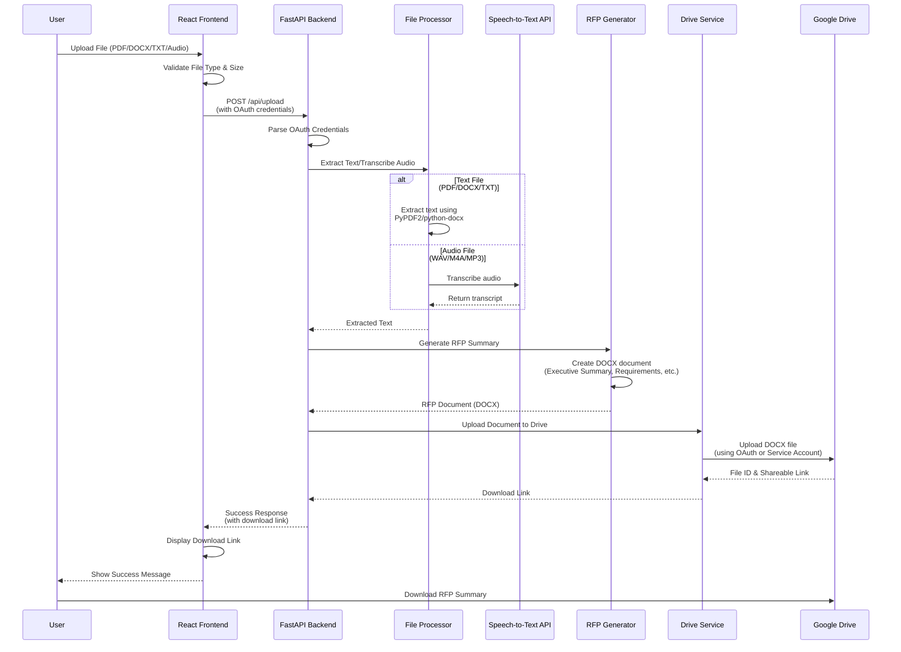
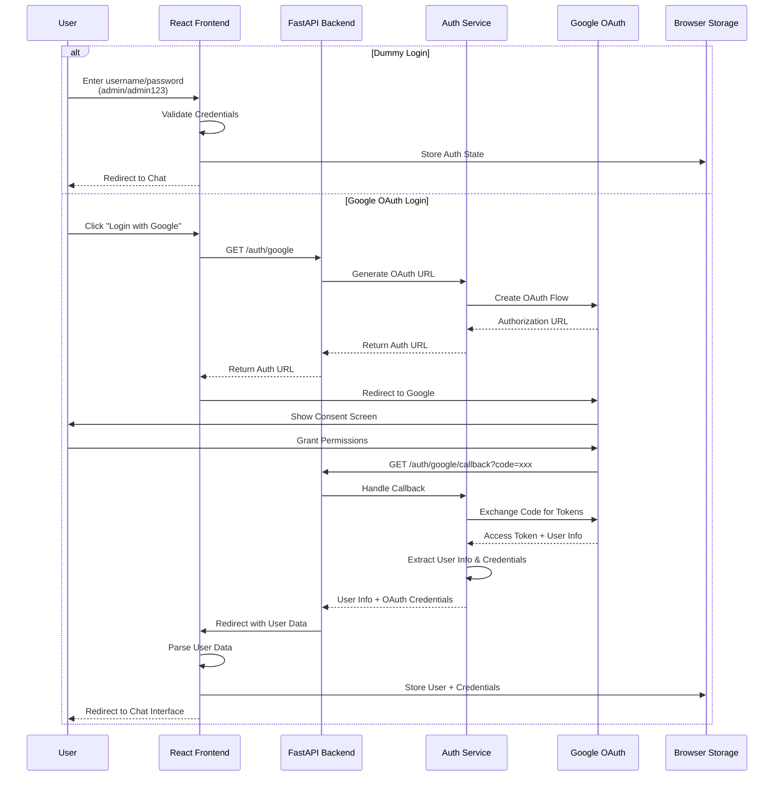
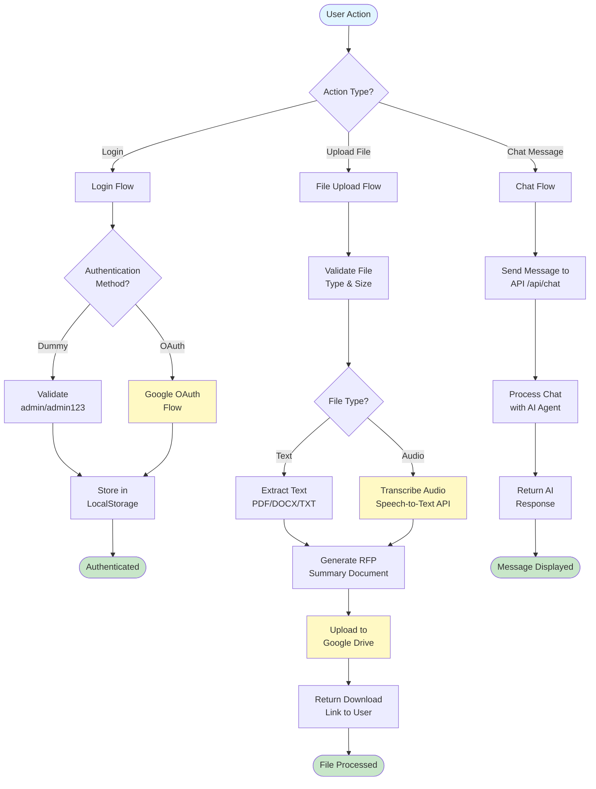
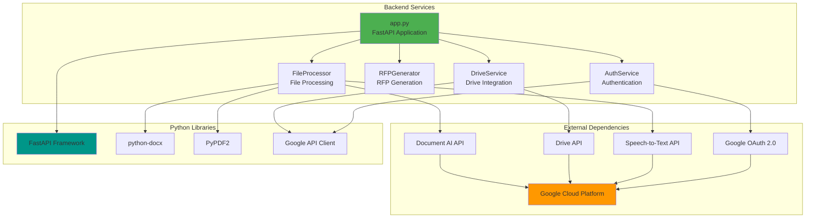
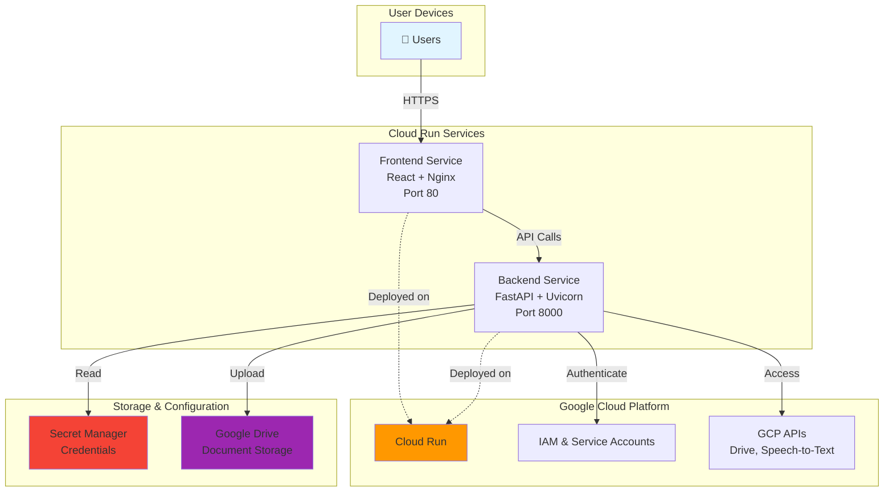
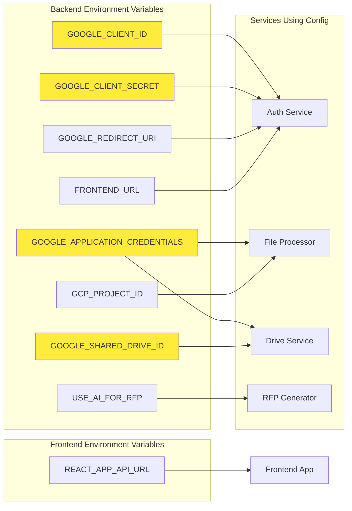
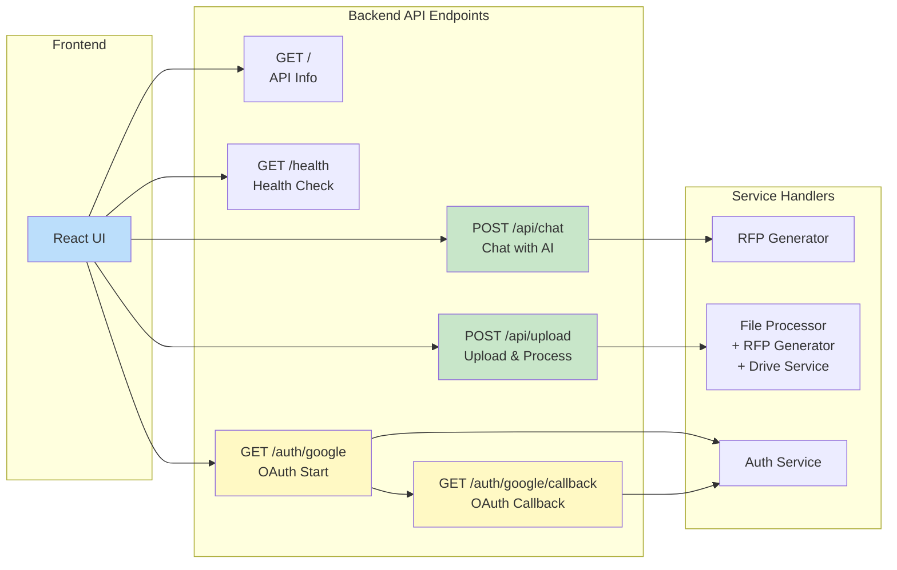

# ZS-RFP-Demo Architecture Diagrams

This document contains Mermaid diagrams illustrating the architecture of the ZS-RFP-Demo application.

## System Architecture Overview

## Component Architecture

## File Upload & Processing Flow

## Authentication Flow

## Data Flow Diagram

## Service Dependencies

## Deployment Architecture

## Environment Configuration

## API Endpoints Overview

---

## How to View These Diagrams

1. **VS Code**: Install the "Markdown Preview Mermaid Support" extension
2. **GitHub**: Diagrams will render automatically in markdown files
3. **Online**: Copy the mermaid code to [Mermaid Live Editor](https://mermaid.live)
4. **Documentation Tools**: Most modern documentation tools support Mermaid

## Diagram Types Explained

- **System Architecture**: High-level overview of all components
- **Component Architecture**: Detailed component relationships
- **Sequence Diagrams**: Step-by-step flow of operations
- **Data Flow**: How data moves through the system
- **Service Dependencies**: What each service depends on
- **Deployment Architecture**: How the system is deployed
- **Environment Configuration**: Configuration management
- **API Endpoints**: API structure and routing

